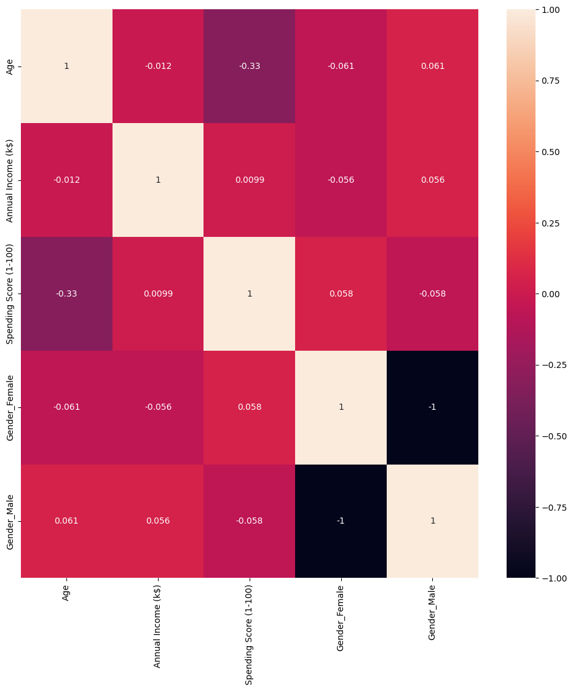

# Customer Segmentation Analysis

## Project Overview

Customer Segmentation Analysis is a data-driven project designed to categorize customers into distinct groups based on their purchasing behaviors and demographic information. By leveraging K- Means clustering algorithm , this project aims to identify patterns within the customer data that can help businesses tailor their marketing strategies, improve customer retention, and enhance overall customer satisfaction.

## Objectives

○  Identify distinct customer segments: Use clustering techniques to group customers based on various features such as age, income, spending habits, and gender.

○ Analyze customer behavior: Understand the characteristics of each segment to gain insights into different customer profiles.

○ Develop a predictive model: Build a model that can predict the segment a new customer belongs to based on their input features.

○ Deploy the model: Create a Flask-based web application that allows users to input customer data and receive a segmentation prediction in real-time.

## Key Features
⦿ Data Preprocessing: Handling missing values, encoding categorical variables, and standardizing features.

⦿ Clustering Analysis: Implementing K-Means  algorithm to identify customer segments.

.png)

⦿ Dimensionality Reduction: Using PCA (Principal Component Analysis) to visualize high-dimensional data in a 2D or 3D space.

.png)

⦿ Outlier Detection: Identifying and removing outliers to improve the accuracy of the clustering.

⦿Web Application: A Flask application that allows users to input customer data and view the predicted customer segment.

.png)

⦿ Visualization: Interactive plots and graphs to visualize the clusters and customer profiles.

##  Mathematical Hypothesis Based on the Heatmap Analysis

### Dependency of Spending Score on Age:

**Hypothesis H₁:** Spending Score (S) is positively correlated with Age (A) more strongly than with other factors. This suggests that as Age increases, Spending Score tends to increase or decrease in a consistent manner.

### Gender-Based Influence on Spending Score:

**Hypothesis H₂:** Spending Score (S) has equal but opposite dependencies on the binary gender variables Male (G_M) and Female (G_F):

- For Male (G_M), the correlation with Spending Score is direct: S ∝ G_M.
- For Female (G_F), the correlation with Spending Score is inverse: S ∝ -G_F.

**Equality of Magnitude:** The magnitude of correlation is identical for both genders, indicating that the effect size is the same but in opposite directions:

If S = k × G_M, then S = -k × G_F,

where k is a constant.
